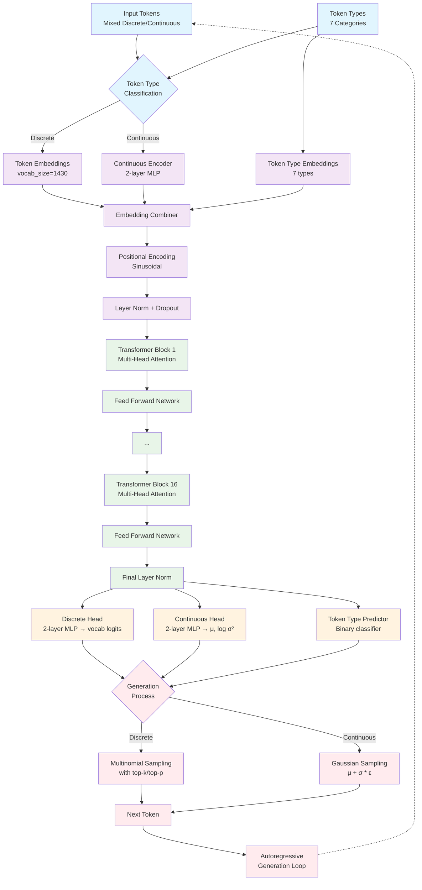

# BIFROST Architecture Documentation

## Overview

BIFROST is an autoregressive transformer model designed for crystal structure generation with property conditioning. The model generates crystal structures as sequences of tokens, where each token can be either discrete (elements, space groups, Wyckoff positions) or continuous (coordinates, lattice parameters).

## Architecture Diagram



## Data Flow Architecture

```mermaid
flowchart LR
    %% Input Processing
    subgraph Input ["Input Processing"]
        A[Token Sequence<br/>e.g., BANDGAP_MED Li COUNT_1 O COUNT_2]
        B[Token Types<br/>e.g., [0, 1, 2, 1, 2]]
        C[Continuous Mask<br/>e.g., [0, 0, 0, 0, 0]]
    end
    
    %% Embedding Layer
    subgraph Embedding ["BIFROSTEmbedding"]
        D[Token Embedding<br/>Lookup Table]
        E[Continuous Encoder<br/>MLP(1 → 64 → 512)]
        F[Token Type Embedding<br/>7 types → 512]
        G[Positional Encoding<br/>sin/cos patterns]
        H[Combine & Normalize<br/>512-dim vectors]
    end
    
    %% Transformer
    subgraph Transformer ["BIFROSTTransformer (16 layers)"]
        I[Multi-Head Attention<br/>16 heads, causal mask]
        J[Feed Forward<br/>512 → 2048 → 512]
        K[Residual + LayerNorm<br/>Pre-norm architecture]
    end
    
    %% Output Heads
    subgraph Heads ["BIFROSTHeads"]
        L[Discrete Head<br/>512 → 512 → 1430]
        M[Continuous Head<br/>512 → 256 → 2]
        N[Type Predictor<br/>512 → 256 → 1]
    end
    
    %% Generation
    subgraph Generation ["Token Generation"]
        O[Type Decision<br/>sigmoid(logits) > 0.5]
        P[Discrete Sampling<br/>softmax + multinomial]
        Q[Continuous Sampling<br/>N(μ, σ²)]
    end
    
    %% Flow
    A --> D
    A --> E
    B --> F
    A --> G
    D --> H
    E --> H
    F --> H
    G --> H
    
    H --> I
    I --> J
    J --> K
    K --> L
    K --> M
    K --> N
    
    L --> P
    M --> Q
    N --> O
    O --> P
    O --> Q
    
    P --> R[Next Token]
    Q --> R
    R --> S[Continue Generation]
    
    %% Styling
    classDef inputStyle fill:#e3f2fd
    classDef embeddingStyle fill:#f1f8e9
    classDef transformerStyle fill:#fce4ec
    classDef headsStyle fill:#fff8e1
    classDef generationStyle fill:#e8eaf6
    
    class A,B,C inputStyle
    class D,E,F,G,H embeddingStyle
    class I,J,K transformerStyle
    class L,M,N headsStyle
    class O,P,Q,R,S generationStyle
```

## Key Design Principles

1. **Mixed Token Types**: Handles both discrete and continuous values in a unified architecture
2. **Property Conditioning**: Uses property prefix tokens to condition generation on target material properties
3. **Autoregressive Generation**: Generates structures sequentially, enabling controllable sampling
4. **Wyckoff-Based Representation**: Uses crystallographic Wyckoff positions for structural efficiency

## Architecture Components

### 1. Embedding Layer (`BIFROSTEmbedding`)

The embedding layer handles the complex task of converting mixed discrete/continuous tokens into a unified embedding space.

**Components:**
- **Token Embeddings**: Standard embedding lookup for discrete tokens (vocab_size=1430)
- **Continuous Value Encoder**: 2-layer MLP that encodes continuous values (coordinates, lattice parameters)
- **Token Type Embeddings**: Separate embeddings for 7 token types (properties, elements, counts, space groups, Wyckoff positions, coordinates, lattice parameters)
- **Positional Encoding**: Sinusoidal positional encoding for sequence position awareness
- **Layer Normalization**: Applied after combining all embedding components

**Key Innovation**: The continuous mask mechanism allows the same token positions to contain either discrete token IDs or continuous float values, with the embedding layer routing appropriately based on token type.

### 2. Transformer Stack (`BIFROSTTransformer`)

Standard transformer architecture optimized for autoregressive generation:

**Configuration:**
- **Model Dimension (d_model)**: 512
- **Attention Heads**: 16 heads
- **Layers**: 16 transformer blocks
- **Feed-Forward Dimension**: 2048
- **Dropout**: 0.1

**Architecture Details:**
- Pre-layer normalization for better training stability
- Causal attention masking for autoregressive generation
- GELU activation in feed-forward networks
- Residual connections around attention and feed-forward layers

### 3. Output Heads (`BIFROSTHeads`)

The model uses three specialized output heads to handle different prediction tasks:

#### Discrete Head
- Predicts probabilities over the discrete vocabulary (1430 tokens)
- 2-layer MLP with ReLU activation and layer normalization
- Handles elements, space groups, Wyckoff positions, property bins, counts

#### Continuous Head
- Predicts parameters for Gaussian distributions over continuous values
- Outputs mean and log-variance for each continuous token
- Used for coordinates (0-1 range) and lattice parameters (varying ranges)

#### Token Type Predictor
- Binary classifier determining whether the next token should be discrete or continuous
- Single linear layer with sigmoid activation
- Guides the generation process to select appropriate output head

### 4. Tokenization System (`BIFROSTTokenizer`)

**Vocabulary Structure (1430 tokens total):**
- **Special Tokens**: PAD, UNK, MASK, SEP, EOS, BOS (6 tokens)
- **Elements**: H through Og (103 tokens)
- **Stoichiometric Counts**: COUNT_1 through COUNT_20 (20 tokens)
- **Space Groups**: SPACE_1 through SPACE_230 (230 tokens)
- **Wyckoff Positions**: WYCK_* tokens for crystallographic orbits (~1000 tokens)
- **Property Bins**: Discretized material properties (71 tokens)

**Token Types (7 categories):**
0. Properties (BANDGAP_MED, DENSITY_HIGH, etc.)
1. Elements (H, Li, C, etc.)
2. Counts (COUNT_1, COUNT_2, etc.)
3. Space Groups (SPACE_1, SPACE_2, etc.)
4. Wyckoff Positions (WYCK_*, mapped to crystallographic orbits)
5. Coordinates (continuous x,y,z values)
6. Lattice Parameters (continuous a,b,c,α,β,γ values)

### 5. Property Conditioning System

**Discretization Strategy:**
Material properties are discretized into 4 bins (NONE, LOW, MED, HIGH) based on domain-specific thresholds:

- **Band Gap**: [0.5, 2.0, 4.0] eV
- **Formation Energy**: [-2.0, -0.5, 0.0] eV/atom
- **Density**: [2.0, 4.0, 8.0] g/cm³
- **Bulk Modulus**: [50, 150, 300] GPa
- **Energy Above Hull**: [0.01, 0.05, 0.1] eV/atom

Properties are encoded as prefix tokens before the main structure sequence, enabling conditional generation.

## Sequence Format

A typical BIFROST sequence follows this structure:

```
[Property Tokens] SEP [Composition] [Space Group] [Wyckoff Positions + Elements + Coordinates] [Lattice Parameters] EOS
```

**Example:**
```
BANDGAP_MED DENSITY_LOW SEP Li COUNT_1 Co COUNT_1 O COUNT_2 SPACE_227 WYCK_orbit_123 Li 0.0 0.0 0.0 WYCK_orbit_456 Co 0.5 0.5 0.5 WYCK_orbit_789 O 0.25 0.25 0.25 4.2 4.2 4.2 90.0 90.0 90.0 EOS
```

## Training and Loss Computation

**Multi-Task Loss Function:**
1. **Discrete Loss**: Cross-entropy loss for discrete token predictions
2. **Continuous Loss**: Gaussian negative log-likelihood for continuous values
3. **Type Loss**: Binary cross-entropy for token type prediction

The model uses teacher forcing during training, with the loss computed autoregressively across the sequence.

## Generation Process

**Autoregressive Sampling:**
1. Start with property prefix tokens
2. For each position:
   - Forward pass through transformer
   - Token type predictor determines discrete vs continuous
   - Sample from appropriate head (discrete multinomial or continuous Gaussian)
   - Append to sequence and continue
3. Stop at EOS token or maximum length

**Sampling Controls:**
- **Temperature**: Controls randomness in both discrete and continuous sampling
- **Top-k/Top-p**: Nucleus sampling for discrete tokens
- **Constraint Validation**: Ensures Wyckoff positions are valid for space groups

## Model Strengths

### 1. **Unified Architecture**
- Single model handles both discrete and continuous aspects of crystal structures
- No need for separate models or post-processing steps
- End-to-end trainable system

### 2. **Crystallographic Awareness**
- Wyckoff position representation respects crystallographic symmetries
- Space group constraints built into tokenization
- Physically meaningful coordinate system (fractional coordinates)

### 3. **Property Conditioning**
- Direct control over target material properties
- Enables inverse design workflows
- Property prefix allows fine-grained control

### 4. **Scalable Generation**
- Autoregressive generation allows for controllable sampling
- Can generate structures of varying complexity
- Supports beam search and other advanced decoding strategies

## Potential Areas for Improvement

### 1. **Sequence Length**
- Current max length (512) may limit complex structures
- Could benefit from longer context or hierarchical approaches

### 2. **Continuous Value Modeling**
- Simple Gaussian assumption may be limiting
- Could explore more sophisticated distributions (mixture models, normalizing flows)

### 3. **Symmetry Enforcement**
- While Wyckoff positions encode symmetry, the model could benefit from explicit symmetry constraints
- Could add symmetry-aware attention mechanisms

### 4. **Multi-Scale Representation**
- Current approach is purely sequential
- Could benefit from hierarchical or graph-based representations for complex structures

### 5. **Property Coverage**
- Current property set is limited to 5 properties
- Could expand to include more material properties (magnetic, optical, etc.)

## Comparison to Alternative Approaches

### vs. Graph Neural Networks
- **Advantages**: Natural handling of variable-size structures, property conditioning, generation flexibility
- **Disadvantages**: Less explicit geometric reasoning, requires more data to learn spatial relationships

### vs. VAE-based Models
- **Advantages**: Autoregressive generation allows better control, no posterior collapse issues
- **Disadvantages**: Sequential generation is slower, harder to parallelize

### vs. Diffusion Models
- **Advantages**: Simpler training objective, established generation quality
- **Disadvantages**: Less interpretable generation process, harder to incorporate discrete elements

## Implementation Notes

### Memory Efficiency
- Model uses approximately 85M parameters (512 dim, 16 layers)
- Embedding layer is the largest component due to vocabulary size
- Gradient checkpointing recommended for large batch training

### Training Stability
- Pre-layer normalization helps with deep network training
- Xavier initialization used throughout
- Dropout applied consistently across components

### Generation Speed
- Autoregressive generation requires O(n) forward passes for sequence length n
- Caching of key-value pairs can speed up inference
- Batch generation possible for multiple structures

## Conclusion

The BIFROST architecture represents a novel approach to crystal structure generation that successfully combines discrete and continuous representations in a unified transformer framework. The property conditioning system enables practical inverse design applications, while the crystallographically-aware tokenization ensures generated structures respect fundamental symmetries.

The architecture's main strengths lie in its unified handling of mixed data types, direct property control, and scalable generation process. Future improvements could focus on extending sequence length, enhancing continuous value modeling, and incorporating more explicit symmetry constraints.

This design provides a solid foundation for crystal structure generation tasks while remaining flexible enough to accommodate future enhancements and applications.
